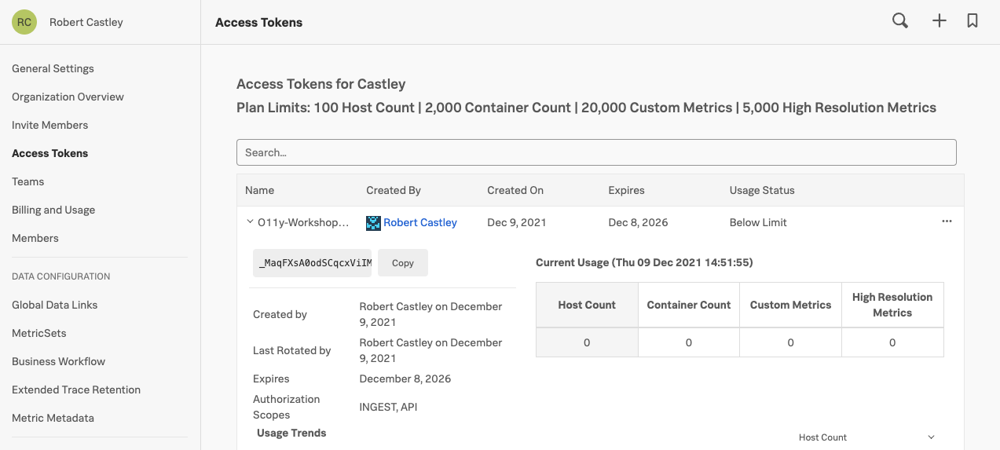
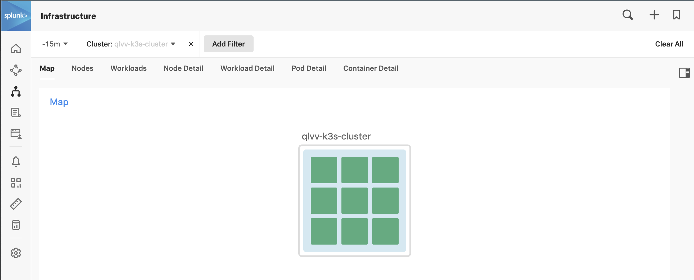
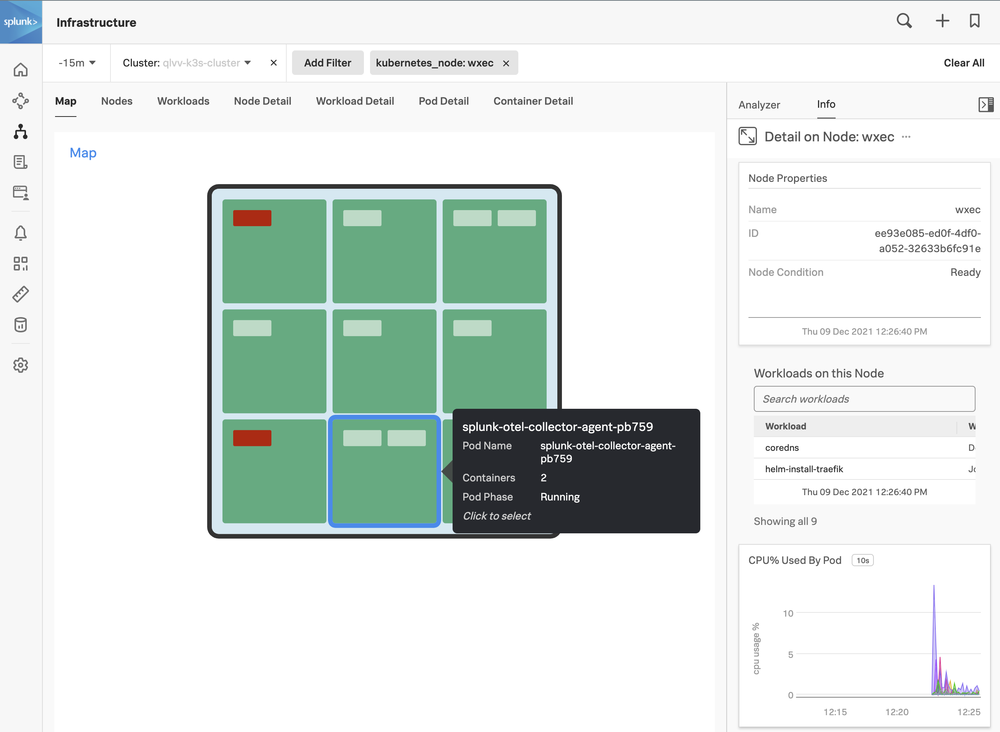

# Kubernetes 環境で OpenTelemetry Collector をデプロイする

* Splunk Helm chartを使用して、K3s に OpenTelemetry Collector をインストールします
* Kubernetes Navigatorでクラスタを探索します

---

## 1. Access Tokenの取得

Kubernetes が起動したら、Splunk の UI から Access Token[^1] を取得する必要があります。

Access Token は、左上のハンバーガーメニューから「**Organization Settings → Access Tokens**」を選択すると表示されます。

**Default** トークンを開き、**Show Token** をクリックしてトークンを公開します。**Copy**{: .label-button .sfx-ui-button-grey} ボタンをクリックして、クリップボードにコピーします。



また、Splunk アカウントの Realm[^2] の名前を取得する必要があります。 ハンバーガーメニューから自分の名前をクリックし、**Account Settings** を選択します。

Realm はページの中央にある Organizations セクションにあります。 この例では「us0」となっています。


---

## 2. Helmによるインストール

環境変数 `ACCESS_TOKEN` と `REALM` を作成して、進行中の Helm のインストールコマンドで使用します。例えば、レルムが `us1` の場合は、`export REALM=us1` と入力し、`eu0` の場合は、`export REALM=eu0` と入力します。

=== "シェルコマンド"

    ```
    export ACCESS_TOKEN=<replace_with_default_access_token>
    export REALM=<replace_with_splunk_realm>
    ```

Splunk Helmチャートを使ってOpenTelemetry Collectorをインストールします。まず、Splunk Helm chartのリポジトリをHelmに追加してアップデートします。

=== "シェルコマンド"

    ```
    helm repo add splunk-otel-collector-chart https://signalfx.github.io/splunk-otel-collector-chart && helm repo update
    ```

=== "出力例"

    ```
    Using ACCESS_TOKEN=<redacted>
    Using REALM=eu0
    "splunk-otel-collector-chart" has been added to your repositories
    Using ACCESS_TOKEN=<redacted>
    Using REALM=eu0
    Hang tight while we grab the latest from your chart repositories...
    ...Successfully got an update from the "splunk-otel-collector-chart" chart repository
    Update Complete. ⎈Happy Helming!⎈
    ```

以下のコマンドでOpenTelemetry Collector Helmチャートをインストールします。**変更しないでください**。

=== "シェルコマンド"

    ```
    helm install splunk-otel-collector \
    --set="splunkRealm=$REALM" \
    --set="splunkAccessToken=$ACCESS_TOKEN" \
    --set="clusterName=$(hostname)-k3s-cluster" \
    --set="logsEnabled=false" \
    --set="environment=$(hostname)-apm-env" \
    splunk-otel-collector-chart/splunk-otel-collector \
    -f ~/workshop/k3s/otel-collector.yaml
    ```

=== "出力例"

    ```
    Using ACCESS_TOKEN=<redacted>
    Using REALM=eu0
    NAME: splunk-otel-collector
    LAST DEPLOYED: Fri May  7 11:19:01 2021
    NAMESPACE: default
    STATUS: deployed
    REVISION: 1
    TEST SUITE: None
    ```

`kubectl get pods` を実行すると、約30秒程度待つと新しいポッドが稼働していることが報告され、デプロイメントの進捗を監視することができます。

続行する前に、ステータスがRunningと報告されていることを確認してください。

=== "シェルコマンド"

    ```text
    kubectl get pods
    ```

=== "出力例"

    ```
    NAME                                                          READY   STATUS    RESTARTS   AGE
    splunk-otel-collector-agent-2sk6k                             0/1     Running   0          10s
    splunk-otel-collector-k8s-cluster-receiver-6956d4446f-gwnd7   0/1     Running   0          10s
    ```

OpenTelemetry Collector podのログを確認して、エラーがないことを確認します。出力は、以下の出力例にあるログに似ているはずです。

ログを確認するには、`helm` のインストールで設定したラベルを使用してください（終了するには ++ctrl+c++ を押します）。もしくは、インストールされている `k9s` ターミナル UI を使うとボーナスポイントがもらえます！

=== "シェルコマンド"

    ```
    kubectl logs -l app=splunk-otel-collector -f
    ```

=== "出力例"

    ```
    2021-03-21T16:11:10.900Z        INFO    service/service.go:364  Starting receivers...
    2021-03-21T16:11:10.900Z        INFO    builder/receivers_builder.go:70 Receiver is starting... {"component_kind": "receiver", "component_type": "prometheus", "component_name": "prometheus"}
    2021-03-21T16:11:11.009Z        INFO    builder/receivers_builder.go:75 Receiver started.       {"component_kind": "receiver", "component_type": "prometheus", "component_name": "prometheus"}
    2021-03-21T16:11:11.009Z        INFO    builder/receivers_builder.go:70 Receiver is starting... {"component_kind": "receiver", "component_type": "k8s_cluster", "component_name": "k8s_cluster"}
    2021-03-21T16:11:11.009Z        INFO    k8sclusterreceiver@v0.21.0/watcher.go:195       Configured Kubernetes MetadataExporter  {"component_kind": "receiver", "component_type": "k8s_cluster", "component_name": "k8s_cluster", "exporter_name": "signalfx"}
    2021-03-21T16:11:11.009Z        INFO    builder/receivers_builder.go:75 Receiver started.       {"component_kind": "receiver", "component_type": "k8s_cluster", "component_name": "k8s_cluster"}
    2021-03-21T16:11:11.009Z        INFO    healthcheck/handler.go:128      Health Check state change       {"component_kind": "extension", "component_type": "health_check", "component_name": "health_check", "status": "ready"}
    2021-03-21T16:11:11.009Z        INFO    service/service.go:267  Everything is ready. Begin running and processing data.
    2021-03-21T16:11:11.009Z        INFO    k8sclusterreceiver@v0.21.0/receiver.go:59       Starting shared informers and wait for initial cache sync.      {"component_kind": "receiver", "component_type": "k8s_cluster", "component_name": "k8s_cluster"}
    2021-03-21T16:11:11.281Z        INFO    k8sclusterreceiver@v0.21.0/receiver.go:75       Completed syncing shared informer caches.       {"component_kind": "receiver", "component_type": "k8s_cluster", "component_name": "k8s_cluster"}
    ```

!!! info "インストールに失敗した場合に削除する"
    OpenTelemetry Collectorのインストールに失敗した場合は、次のようにしてインストールを削除することで、最初からやり直すことができます。

    `helm delete splunk-otel-collector` 

---

## 3. UI でのメトリクスの検証

Splunk の UI で左上のハンバーガーメニューから **Infrastructure** をクリックします。


**Containers** の下にある **Kubernetes** をクリックしてKubernetes Navigator Cluster Map を開き、メトリクスが送信されていることを確認します。

クラスタが検出され、レポートされていることを確認するには、自分のクラスタを探します（ワークショップでは、他の多くのクラスタが表示されます）。クラスタ名を見つけるには、以下のコマンドを実行し、出力をクリップボードにコピーしてください。

=== "シェルコマンド"
  
    ```text
    echo $(hostname)-k3s-cluster
    ```

次にUIで、Splunkロゴのすぐ下にある「Cluster: - 」メニューをクリックし、コピーしたばかりのクラスタ名を検索ボックスに貼り付け、ボックスをクリックしてクラスタを選択し、最後にメニューから空白をクリックしてフィルタを適用します。




ノードの状態を確認するには、クラスターの淡いブルーの背景にカーソルを置き、左上に表示される青い虫眼鏡をクリックしてください 。

これで、ノードレベルまでドリルダウンできます。 次に、サイドバーボタンをクリックしてサイドバーを開き、Metricsサイドバーを開きます。

サイドのスライダーを使って、CPU、メモリ、ネットワーク、イベントなど、クラスタ/ノードに関連する様々なチャートを見ることができます。



[^1]: Access Tokens (Org Tokensと呼ばれることもあります)は、長期間利用を前提とした組織レベルのトークンです。デフォルトでは、これらのトークンは 5 年間保存されます。そのため、長期間にわたってデータポイントを送信するエミッターに組み込んだり、Splunk API を呼び出す長期的なスクリプトに使用したりするのに適しています。

[^2]: Realm とは、Splunk内部の管理単位ので、その中で組織がホストされます。異なる Realm には異なる API エンドポイントがあります (たとえば、データを送信するためのエンドポイントは、**`us1`** realm では `ingest.us1.signalfx.com` 、**`eu0`** レルムでは `ingest.eu0.signalfx.com` となります)。このrealm名は、Splunk UI のプロファイルページに表示されます。エンドポイントを指定する際にレルム名を含めない場合、Splunk は **`us0`** レルムを指していると解釈します。
